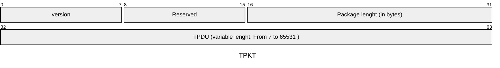
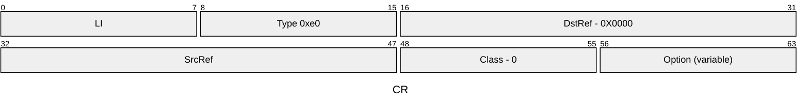
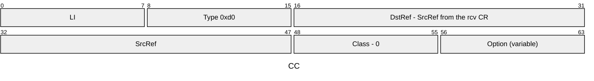
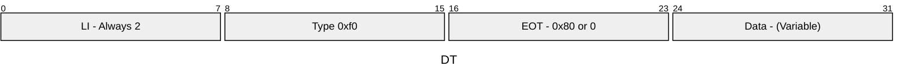
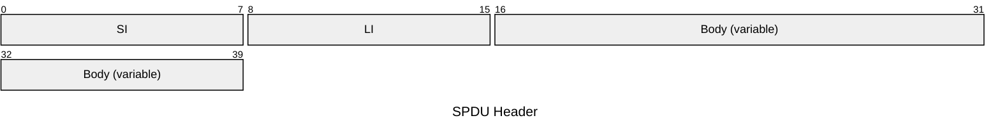
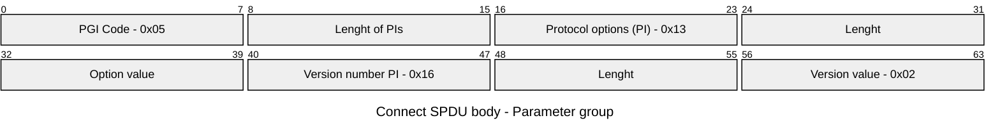
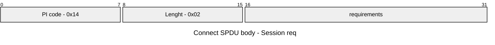
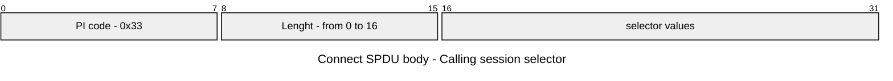

# IEC 61850

A rust implementation of the IEC61850 protocol

## Stack


### [ISO COTP Structure](https://datatracker.ietf.org/doc/html/rfc1006)

ref:

- <https://www.rfc-editor.org/rfc/rfc905.html>
- <https://datatracker.ietf.org/doc/html/rfc1006>



The packed length includes the header. This means the maximum size of a TPDU is 65531.

TPDU types:

- CR - Connection Request
- CC - Connection Confirm
- DT - Data transfer





For CR and CC, the LI is the length of the request discounting the LI itself. So, the option size is LI-6.



The size of the data is the TPKT package length - 4 (TPKT header) - 3 (DT TPDU header)

### ISO Session Structure



SPDU Identifiers

- Connect (CN): 0x0D
- Accept (AC): 0x0E
- Refuse: 0x0C
- Data (DT): 0x01
- Finish (FN): 0x09
- Disconnect (DN): 0x0A
- Abort (AB): 0x19
- Not finished: 0x08







```text
SPDU
 ├─ SI (SPDU Identifier) - 1 byte
 ├─ LI (Length Indicator) - 1 byte
 └─ Body
     ├─ Parameter Groups (PGI)
     │   └─ Parameters (PI)
     │       └─ Parameter Values
     └─ User Data (optional)
```

Session requirements

```text
Bit Position | Hex Value | Functional Unit          | Description
-------------|-----------|--------------------------|---------------------------
Bit 0        | 0x0001    | Kernel                   | Basic session services (always required)
Bit 1        | 0x0002    | Half-Duplex (HDX)        | Half-duplex data transfer
Bit 2        | 0x0004    | Duplex (DUP)             | Full-duplex data transfer
Bit 3        | 0x0008    | Expedited Data           | Send urgent/expedited data
Bit 4        | 0x0010    | Minor Synchronize        | Minor sync points
Bit 5        | 0x0020    | Major Synchronize        | Major sync points
Bit 6        | 0x0040    | Resynchronize            | Session resynchronization
Bit 7        | 0x0080    | Activity Management      | Activity start/stop/resume
Bit 8        | 0x0100    | Negotiated Release       | Coordinated session release
Bit 9        | 0x0200    | Capability Data Exchange | Exchange capability info
Bit 10       | 0x0400    | Exceptions               | Exception reporting
Bit 11       | 0x0800    | Typed Data               | Typed data transfer
Bit 12-15    | Reserved  | -                        | Reserved for future use
```

asn1 lib: <https://github.com/librasn/rasn?tab=readme-ov-file>
asn1 classes def: <https://github.com/beanit/iec61850bean/blob/master/asn1/readme.txt>
asn1 from wireshark: <https://github.com/wireshark/wireshark/blob/master/epan/dissectors/asn1/mms/mms.asn>

<https://sislab.no/MMS_Notat.pdf>

| IEC61850 Obj | MMS Obj |
|--------------|---------|
| Server | VMD |
| LD | Domain|
| LN | NamedVariable |
| Data | NamedComponent |
| DataAttr | NamedComponent |
| DataSet | NamedVariableList |
