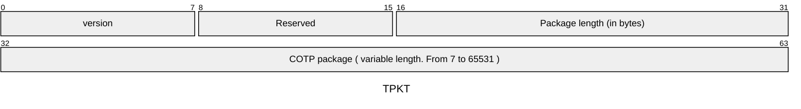
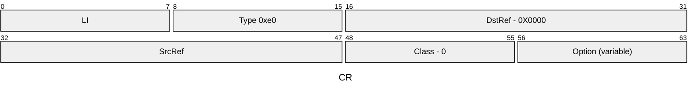
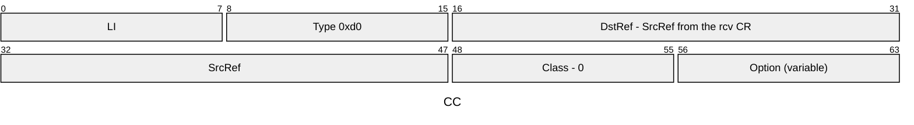
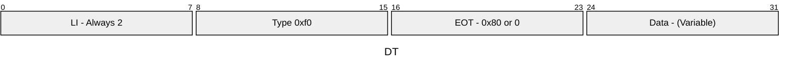
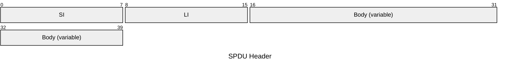

# MMS Protocol

The manufacturing message specification (MMS) stack protocol is not fully implemented. Only the necessary parts for the IEC61850 where implemented. This document will describe a little bit how the layers on this protocol work.

## Stack


The stack is composed by 5 layers on top of the tcp layer.

* COTP (rfc905) + ISO over tcp (rfc1006) as a transport layer
* ISO Session (ISO 8327) as a session layer
* ISO Presentation (ISO 8823) as a presentation layer encoded using ASN.1 BER
* ACSE (ISO 8650) as an application layer encoded using ASN.1 BER
* MMS (ISO 9506) on top of the ACSE encoded using ASN.1 BER

## Transport Layer

The transport layer is compose by two parts. The first is the [COTP protocol](https://www.rfc-editor.org/rfc/rfc905.html) and the second is an adaptation layer describe by the [RFC1006](https://datatracker.ietf.org/doc/html/rfc1006) for the COTP to run over tcp.

### ISO Over TCP

The iso over tcp layer is an adaptation layer that will split the copt packages to fit in the maximum size. This layer will also reconstruct the cotp packages.

The split packages are called TPKT and this is their structure



The length is an u16 so the maximum size is 65535. Since the length includes the header,  the maximum size of a COTP is 65531.

### COTP

The COTP standard defines several classes of object but for the Iso over tcp only the class 0 is accepted.

The COTP class 0 have 3 different packages that can be sent, Connection Request (CR), Connection Confirm (CC) and Data Transfer (DT). When the client connects to the server it first sends a CR with the desired parameters for the connection and waits for a CC from the server with the response for the negotiated parameters. After this handshake both client and server can start to send DT packages.

Here is the structure of all 3 packages





For CR and CC, the LI is the length of the request discounting the LI itself. So, the option size is LI-6.

The available options are the TPDU size, the source and destination T-selectors. All the options are encoded using the first byte for the code of the option, the second byte for the length and the rest for the values. The exactly structure for each option can be found at section [13.3.4](https://www.rfc-editor.org/rfc/rfc905.html#section-13.3.4) of the spec



The size of the data is the TPKT package length - 4 (TPKT header) - 3 (DT TPDU header)
An upper layer payload can be split in several DT. The EOT indicates whether there is more packages to come to forme the current payloads

## ISO Session

The session layer package is compose by a header and a body. Here is the structure of the header.



Where the SI is the SPDU (ISO Session package) identifier. Here are the possible values:

SPDU Identifiers

* Connect (CN): 0x0D
* Accept (AC): 0x0E
* Refuse: 0x0C
* Data (DT): 0x01
* Finish (FN): 0x09
* Disconnect (DN): 0x0A
* Abort (AB): 0x19
* Not finished: 0x08

The connection starts with the client sending a CN SPDU with the desired configurations and the server responds with a AC SPDU with the negotiated parameters.

The CN and AC SPDUs have a very similar structure. They both have a list of parameter groups. Each group starts with it's identifier (PGI) followed by how many items the group has and each parameter of the group.

```text
SPDU
 ├─ SI (SPDU Identifier) - 1 byte
 ├─ LI (Length Indicator) - 1 byte
 └─ Body
     ├─ Parameter Groups (PGI)
     │   └─ Parameters (PI)
     |       └─ Parameter Length
     │       └─ Parameter Values
     ├─ Parameter Groups (PGI)
     │   └─ Parameters (PI)
     |       └─ Parameter Length
     │       └─ Parameter Values
     ...
```

The possible PGIs are:

|  Name |  Value  |
|------|----------|
| ConnectionIdentifier | 0x01|
|    ConnectAcceptItem | 0x05 |
|    TransportDisconnect | 0x11 |
|    SessionUserRequirements | 0x14 |
|    EnclosureItem | 0x19 |
|    Unknown49 | 0x31 |
|    CallingSessionSelector | 0x33 |
|    CalledSessionSelector | 0x34 |
|    DataOverflow | 0x3C |
|    UserData | 0xC1 |
|    ExtendedUserData | 0xC2 |
|    Invalid |0xFF |

The last PGI is always the UserData and it always contains the payload of the upper layer.

The possible PI are:

|  Name  |  Value  |
|--------|---------|
|    ProtocolOptions | 0x13|
|    TsduMaximumSize | 0x15|
|    VersionNumber | 0x16|
|    InitialSerialNumber | 0x17|
|    TokenSettingItem | 0x1A|
|    ReasonCode | 0x32|
|    SecondInitialSerialNumber | 0x37|
|    UpperLimitSerialNumber | 0x38|
|    LargeInitialSerialNumber | 0x39|
|    LargeSecondInitialSerialNumber | 0x3A|
|    Invalid | 0xFF|

## ISO Presentation

The ISO Presentation layer is encoded using the [ASN.1](https://en.wikipedia.org/wiki/ASN.1) [BER](https://en.wikipedia.org/wiki/X.690#BER_encoding) encoding. ASN.1 (Abstract Syntax Notation One) is a widely used notation and there are many compiler/generators of code from the ASN.1 format. The basic encoding rules (BER) is also widely used and there libs for encoding and decoding in many languages.

Since this layer is encode in such well know format object structures definitions can be found online. For this implementation I adapted the definitions from the Wireshark repository. The definitions for this layer can be found at [Wireshark repo](https://github.com/wireshark/wireshark/blob/master/epan/dissectors/asn1/pres/ISO8823-PRESENTATION.asn)

The connection starts with the client sending a CP request with the desired parameters and receiving a CPA response with the negotiated parameters. Both CP and CPA requests contain payloads from the upper layers.

On the CP object we define two different contexts, the ACSE context and the MMS context. Both use BER encoding.

These 3 identifiers have the following values

| OID | Value |
|-----|-------|
| BER | 2.1.1 |
| ACSE | 2.2.1.0.1 |
| MMS | 1.0.9506.2.1 |

After the connection is stablish data is exchanges using the UserData object and the context OID MMS.

## ACSE

This layer also uses ASN.1 BER encoding and the definitions can also be found on the [Wireshark repo](https://github.com/wireshark/wireshark/blob/master/epan/dissectors/asn1/acse/acse.asn).

This layer is only used during the connection and later it just acts as a passthrough.

## MMS

This layer also uses ASN.1 BER encoding and the definitions can also be found on the [Wireshark repo](https://github.com/wireshark/wireshark/blob/master/epan/dissectors/asn1/mms/mms.asn).

The connection initiates with the client sending a Initiate-RequestPDU. In this request the client sends the desired connection parameters like the supported options and services. The server responds with a Initiate-ResponsePDU. This pdu contains the negotiated parameters and the serve capabilities. After the initial handshake the client can make rpc style calls and receive unsolicited responses.

For rpc style calls the client sends a Confirmed Service Request. This request contains the called service and a invocation id used to match the server response with the client request. The server then responds with a Confirmed Service Response or a Confirmed Error.

The server can also send unsolicited messages to notify clients. This messages are of the type Unconfirmed Requests and have no invoke id
